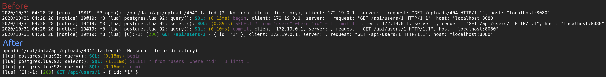

# nginx-quiet

This script strips and outputs each line of output from nginx. Use this to remove unnecessary and repetitive output that you usually don't care about while developing applications in [OpenResty](https://openresty.org/) and [Lapis](https://leafo.net/lapis/).



## Usage

### openresty/nginx
```
openresty -g 'daemon off;' 2>&1 | luajit nginx-quiet.lua
```

### lapis
```
lapis server 2>&1 | luajit nginx-quiet.lua
```

### docker-compose
Add one of the following lines to your service:
```
command: bash -c "openresty -g 'daemon off;' 2>&1 | luajit nginx-quiet.lua"
```
```
command: bash -c "lapis server 2>&1 | luajit nginx-quiet.lua"
```
